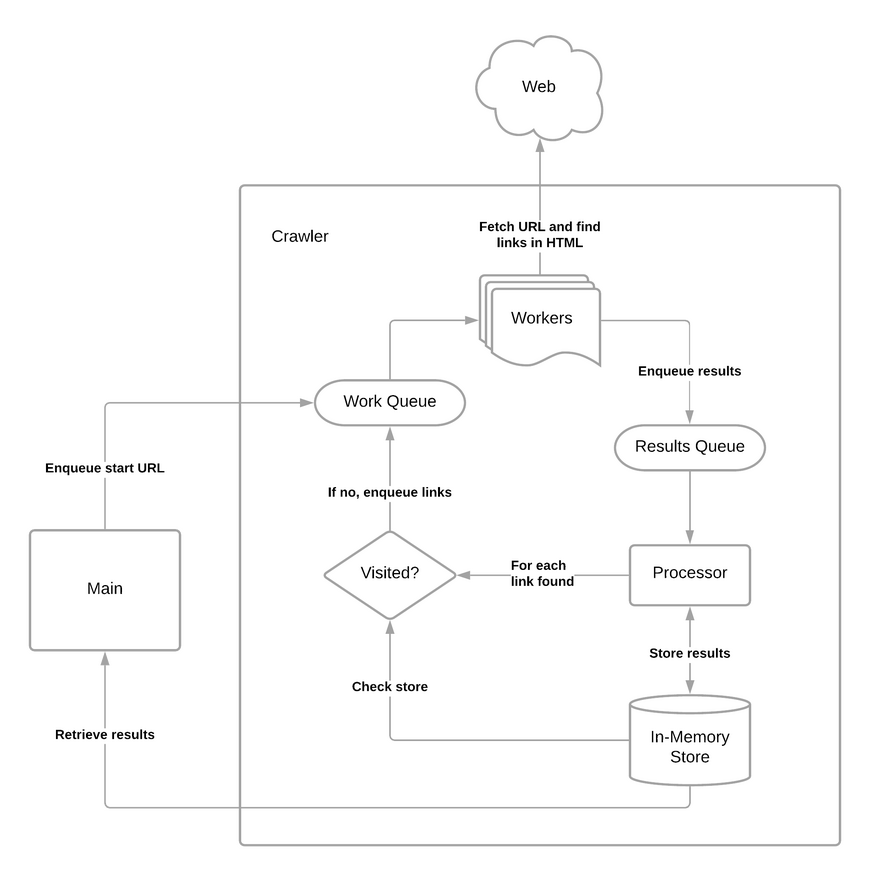

[![ci-badge]][ci-workflow] [![release-badge]][release-workflow]

[ci-badge]: https://github.com/jace-ys/mcrawl/workflows/ci/badge.svg
[ci-workflow]: https://github.com/jace-ys/mcrawl/actions?query=workflow%3Aci
[release-badge]: https://github.com/jace-ys/mcrawl/workflows/release/badge.svg
[release-workflow]: https://github.com/jace-ys/mcrawl/actions?query=workflow%3Arelease

# MCrawl

This is an implementation of a CLI-based web crawler written in Golang, a take home test done as part of [Monzo](https://monzo.com/)'s interview process. This project aims to be a representation of how I would structure and write code in production.

## Brief

_We'd like you to write a simple web crawler in a programming language you're familiar with. Given a starting URL, the crawler should visit each URL it finds on the same domain. It should print each URL visited, and a list of links found on that page. The crawler should be limited to one subdomain - so when you start with *https://monzo.com/*, it would crawl all pages within monzo.com, but not follow external links, for example to facebook.com or community.monzo.com._

_We would like to see your own implementation of a web crawler. Please do not use frameworks like scrapy or go-colly which handle all the crawling behind the scenes or someone else's code. You are welcome to use libraries to handle things like HTML parsing._

## Installation

#### Pre-Compiled Binaries

Pre-compiled `mcrawl` binaries for the following platforms can be found under the [Releases](https://github.com/jace-ys/mcrawl/releases) section of this repository.

#### Build From Source

Download this repository and build the binary from source using the given [Makefile](Makefile) (requires `go 1.15+`):

```shell
$ make
```

This will compile and place the `mcrawl` binary into a local `bin` directory.

## Usage

The web crawler can be invoked via the CLI:

```shell
$ mcrawl [<flags>] <url>
```

#### Help

Use the `--help` flag to view help description on using the CLI:

```shell
$ mcrawl --help
usage: mcrawl [<flags>] <url>

Flags:
  --help        Show context-sensitive help (also try --help-long and --help-man).
  --workers=10  Number of concurrent workers to use for crawling.
  --robotstxt   Respect the site's robots.txt file, if any, while crawling.
  --debug       Run the web crawler in debug mode.

Args:
  <url>  URL to start crawling from. Will only follow URLs belonging to the given URL's subdomain.
```

#### Example

```shell
$ mcrawl --workers 20 http://monzo.com/
...
https://monzo.com/i/loans/home-improvement-loans
  -> https://monzo.com/features/savings
  -> https://www.instagram.com/monzo
  ...
  -> https://monzo.com/about
  -> https://monzo.com/i/fraud
...
======================
Unique URLs crawled: 1675
Time taken: 325.539s
```

#### Output

Currently, all output is printed to stdout by default. To write the output to a file, use shell redirection.

Bash example:

```shell
$ mcrawl --workers 20 http://monzo.com/ >> output.txt
```

## Development

The given [Makefile](Makefile) provides some basic utilities to facilitate the development process:

- To run the code formatter:

  ```shell
  make fmt
  ```

- To run tests:

  ```shell
  make test
  ```

#### Release

Pre-compiled versions of the `mcrawl` binary for different platforms are automatically published to GitHub via [GoReleaser](https://goreleaser.com/) and GitHub Actions whenever a new tag is pushed to the repository.

See [.github/workflows/release.yaml](.github/workflows/release.yaml) and [.goreleaser.yml](.goreleaser.yml) for more information on how this automated release process works.

## Approach

A high-level architecture of how the web crawler is designed is described in the figure below.



The core components of the web crawler reside in the [crawler](pkg/crawler) package. Essentially, the crawler spawns a number of concurrent workers in the background that picks up URLs to crawl from a work queue, fetches the links found on each HTML page, and puts them into a results queue. At the same time, results are processed by a separate worker, whose job is to store the links found for each URL and enqueue those links back onto the work queue to be crawled. The crawler defines two interfaces - `Fetcher` and `Excluder` - which faciliate testing and customising of the crawler.

The [fetchers](pkg/fetchers) package defines a `LinksFetcher`, that fulfils the `crawler.Fetcher` interface, used for making HTTP requests, parsing HTML content, and returning all unique resolved links found. LinksFetcher also normalizes links, so that the crawler doesn't have to re-visit pages it's seen before.

The [excluders](pkg/excluders) package defines a `RobotsTxtExcluder`, that fulfils the `crawler.Excluder` interface, that excludes paths based on rules defined in the requested site's [robots.txt](https://developers.google.com/search/docs/advanced/robots/intro?hl=en&visit_id=637418278654192602-1692893848&rd=1) file (if any). This allows the crawler to respect robots.txt and not crawl paths it shouldn't. This feature is turned on by default, but can be turned off via a CLI flag.

## Improvements

- [ ] Limit crawl depth
- [ ] Implement retries
- [ ] Write output to file
- [ ] Add timeouts to HTTP requests
- [ ] Render JavaScript (eg. non-SSR SPAs)
- [ ] Track URLs being processed to reduce duplicate work
- [ ] Exclude non-HTML file-based links (eg. `.pdf`, `.json`)
